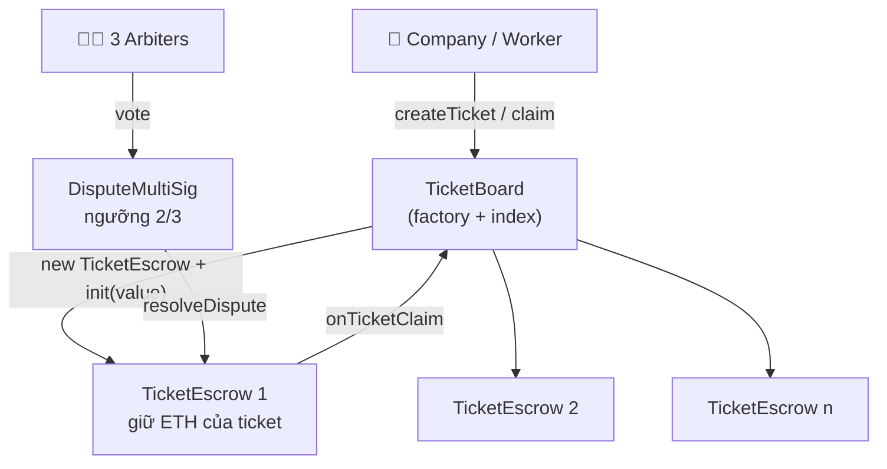
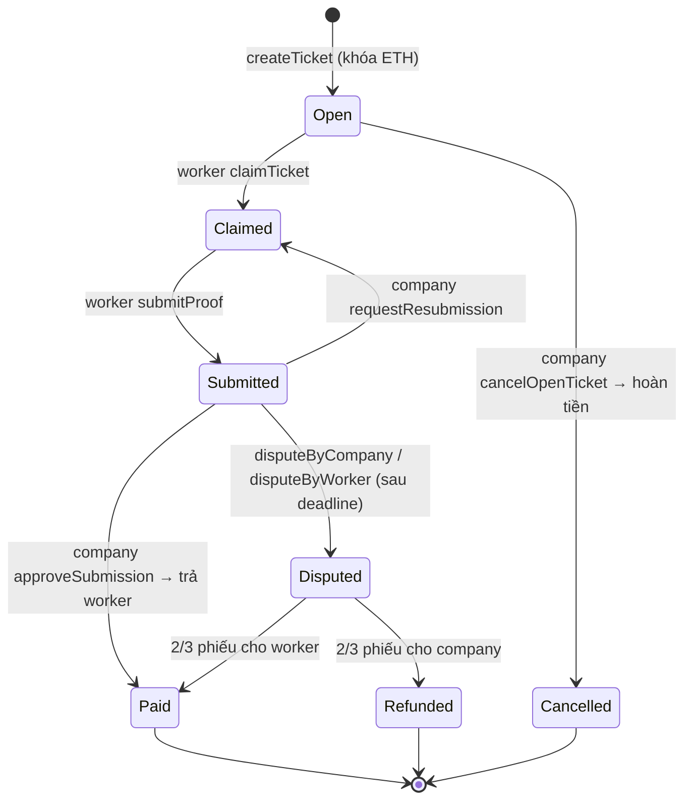

# TrustLance — Ticket Escrow phi tập trung

Nền tảng giao việc theo dạng **ticket** giữa doanh nghiệp và cộng tác viên, trong đó tiền công được **khóa trong smart contract** ngay khi ticket được tạo và chỉ được giải ngân khi công việc được nghiệm thu — hoặc khi hội đồng trọng tài biểu quyết.

- Doanh nghiệp đăng ticket kèm tiền cọc (ETH) → tiền vào escrow, không ai rút ra được.
- Cộng tác viên nhận ticket (first-come), làm xong thì nộp minh chứng.
- Doanh nghiệp duyệt → worker nhận tiền. Yêu cầu làm lại → quay về trạng thái đang làm.
- Bất đồng → mở tranh chấp, **3 trọng tài bỏ phiếu, đủ 2/3 là contract tự chi tiền** cho bên thắng.

| | |
|---|---|
| Blockchain | Solidity `0.8.24`, Hardhat, mạng local `chainId 31337` |
| Frontend | React 19 + Vite 7 + TailwindCSS 3, ethers v6, framer-motion, lucide-react |
| Test | Hardhat + Chai — 5 bộ test cho từng contract, luồng E2E và edge case bảo mật |

---

## Kiến trúc

Ba contract phối hợp với nhau, mỗi ticket là **một contract escrow riêng biệt** do factory sinh ra:



| Contract | Vai trò |
|---|---|
| [`TicketBoard.sol`](contracts/TicketBoard.sol) | Factory tạo escrow, giữ danh sách toàn bộ ticket, index theo company và theo worker |
| [`TicketEscrow.sol`](contracts/TicketEscrow.sol) | Giữ ETH và toàn bộ state machine của một ticket; chỉ factory được `init` / `setArbiter` |
| [`DisputeMultiSig.sol`](contracts/DisputeMultiSig.sol) | Multisig của trọng tài, mỗi người 1 phiếu/ticket, đủ `required` phiếu thì gọi thẳng `resolveDispute` |

### Vòng đời một ticket



Các ràng buộc đáng chú ý được thực thi on-chain:

- Company **không thể** tự claim ticket của mình.
- Worker chỉ mở tranh chấp được **sau deadline** (chống spam); company mở được ngay sau khi có submission.
- `approveSubmission` / `resolveDispute` đổi trạng thái **trước** khi chuyển tiền, và gán `amount = 0` trước khi `call` — chống reentrancy.
- Trọng tài không bỏ phiếu 2 lần cho cùng một ticket, không bỏ phiếu sau khi tranh chấp đã ngã ngũ.

---

## Chạy thử trong 5 phút

**Yêu cầu:** Node.js 18+, npm, MetaMask.

```bash
# 1. Cài dependencies
npm install
cd frontend && npm install && cd ..

# 2. Bật blockchain local (giữ terminal này chạy)
npx hardhat node --hostname 0.0.0.0

# 3. Terminal khác: compile + deploy + tạo sẵn 1 demo ticket
npx hardhat run scripts/deploy.js --network localhost

# 4. Chạy frontend
cd frontend
npm run dev -- --host 0.0.0.0
```

Mở http://localhost:5173 và bấm **Connect Wallet**.

### Cấu hình MetaMask

Thêm network thủ công:

| Trường | Giá trị |
|---|---|
| Network name | Hardhat Local |
| RPC URL | `http://127.0.0.1:8545` |
| Chain ID | `31337` |
| Currency | ETH |

Rồi **import private key** của các account do `hardhat node` in ra ở terminal. Vai trò theo đúng thứ tự mà `deploy.js` gán:

| Account | Vai trò |
|---|---|
| `#0` | Deployer + company của demo ticket |
| `#1`, `#2`, `#3` | 3 trọng tài (ngưỡng 2/3) |
| `#4` trở đi | Dùng làm worker để claim ticket |

> ⚠️ Đây là private key công khai của Hardhat — **tuyệt đối không** dùng cho ví thật hoặc gửi tiền thật vào.

### Sau mỗi lần deploy lại

`deploy.js` ghi địa chỉ mới vào [`deployments/localhost.json`](deployments/localhost.json). Frontend đọc địa chỉ từ [`frontend/src/config.js`](frontend/src/config.js) — nếu hai bên lệch nhau thì copy `board` và `multisig` sang file config rồi restart Vite:

```js
export const TICKET_BOARD_ADDRESS = "0x...";  // = board
export const MULTISIG_ADDRESS     = "0x...";  // = multisig
export const CHAIN_ID = 31337;
```

Địa chỉ thường giữ nguyên nếu bạn restart `hardhat node` sạch trước khi deploy (nonce về 0). Nếu MetaMask báo lỗi nonce sau khi restart node: Settings → Advanced → **Clear activity tab data**.

---

## Lệnh thường dùng

| Lệnh | Tác dụng |
|---|---|
| `npm run compile` | Compile contract |
| `npm test` | Chạy toàn bộ test suite |
| `npm run test:coverage` | Báo cáo coverage |
| `npm run clean` | Xóa `artifacts/` và `cache/` |
| `npx hardhat run scripts/deploy.js --network localhost` | Deploy + tạo demo ticket |
| `npx hardhat run scripts/simulate.js --network localhost` | Diễn lại luồng claim → submit → dispute → 2/3 phiếu → trả tiền |
| `node scripts/check.js` | Kiểm tra biến môi trường (`API_URL`, `PRIVATE_KEY`) |
| `REPORT_GAS=true npx hardhat test` | Test kèm báo cáo gas |

---

## Test

```bash
npm test
```

| File | Nội dung |
|---|---|
| [`test/TicketBoard.test.js`](test/TicketBoard.test.js) | Tạo ticket, validate tham số, các hàm view, index theo company/worker |
| [`test/TicketEscrow.test.js`](test/TicketEscrow.test.js) | Claim, submit, approve, resubmission, cancel, dispute, chi trả |
| [`test/DisputeMultiSig.test.js`](test/DisputeMultiSig.test.js) | Bỏ phiếu, ngưỡng, hòa phiếu, tách biệt phiếu giữa các ticket |
| [`test/TicketFlow.test.js`](test/TicketFlow.test.js) | Luồng end-to-end từ tạo ticket đến giải quyết tranh chấp |
| [`test/EdgeCases.test.js`](test/EdgeCases.test.js) | Bảo mật: deploy escrow trực tiếp, init 2 lần, toàn vẹn thanh toán, events, điều kiện biên |

---

## Cấu trúc thư mục

```
contracts/          3 smart contract Solidity
scripts/            deploy.js · simulate.js · check.js
test/               5 bộ test Hardhat + Chai
deployments/        địa chỉ contract sau khi deploy (localhost.json)
docs/               smart-contract.md (đặc tả) · DIAGRAMS.md (sơ đồ)
frontend/
  src/components/   Layout, TicketBoard, TicketCard, TicketDetailPanel,
                    CreateTicketForm, DisputePanel, ArbiterPanel, WalletCard, ...
  src/lib/          contracts.js (khởi tạo contract) · ethereum.js (kết nối ví)
  src/abi/          ABI export từ artifacts
  src/config.js     địa chỉ contract + chainId
```

---

## Tài liệu

- [`docs/smart-contract.md`](docs/smart-contract.md) — đặc tả chi tiết từng contract: biến trạng thái, hàm, modifier
- [`docs/DIAGRAMS.md`](docs/DIAGRAMS.md) — sơ đồ kiến trúc, sequence diagram, state machine

## Cấu hình môi trường (tùy chọn)

Chỉ cần khi deploy lên testnet. Tạo file `.env` ở thư mục gốc:

```env
API_URL=https://eth-sepolia.g.alchemy.com/v2/<key>
PRIVATE_KEY=<private key không có tiền tố 0x>
ETHERSCAN_API_KEY=<key>
```

Network `sepolia` hiện đang bị comment trong [`hardhat.config.js`](hardhat.config.js) — bỏ comment để dùng. `.env` đã nằm trong `.gitignore`.

---

## Giới hạn hiện tại

- Mới chạy trên Hardhat local, chưa deploy testnet/mainnet.
- Danh sách trọng tài **cố định lúc deploy**, chưa có cơ chế thêm/bớt hay đổi ngưỡng.
- Minh chứng công việc lưu bằng **CID dạng string**, chưa tích hợp upload IPFS thật.
- Contract chưa qua audit — dự án phục vụ mục đích học tập.
